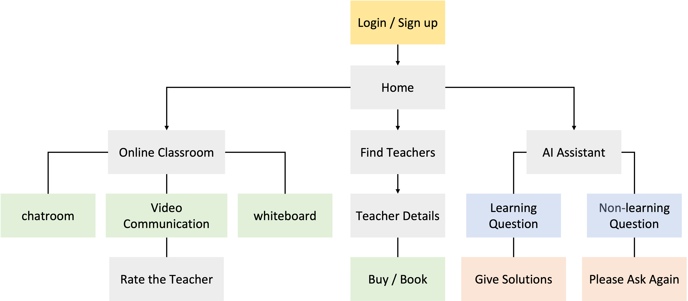

# YiTUTOR

[YiTUTOR](https://yitutor.vercel.app/) is an online tutoring platform facilitating virtual classes via interactive whiteboards, video conferencing and chatrooom, complemented by an AI assistant for enhanced learning support.

## About YiTUTOR

-   Developed using Next.js and TypeScript, and deployed on Vercel.
-   Built a membership system with Firebase Authentication, avoiding props drilling using useContext.
-   Created a high-performance tutor search system with nested filters, enabling students to find tutors based on their needs. Efficiently managing data with Firestore database for CRUD interactions.
-   Implemented video communication using WebRTC API without libraries, providing users with the option to enable or disable video, audio, and microphone.
-   Established a whiteboard feature using Canvas API without libraries, providing options for pen customization, shape drawing, and functions such as copy, paste, delete, move, resize, and clear.
-   Created a real-time chatroom using Firestore onSnapshot API, facilitating user communication during online classes.
-   Integrated the AI assistant with the GPT-3.5 API, using prompts to restrict questions only to those related to learning.

## Built with

**Base**

-   React.js
-   TypeScript
-   Next.js
-   Firebase
-   Styled Components
-   WebRTC
-   Canvas

**Libraries**

-   antd
-   react-select
-   react-spinners

## Flow chart

## Demo

-   Students buy courses and book the time with tutors.

-   In an online classroom, students can experience various features that facilitate the learning process, including video conferencing, a whiteboard, and a chatroom.

1. Users with the option to enable or disable video, audio, and microphone.
   
2. In the whiteboard, users have access to features such as pen customization, shape drawing, as well as features like copy, paste, delete, move, resize, and clear.
   
3. The real-time chat room enables both parties to communicate instantly during class.
   
4. The AI assistant restricts users to asking only questions related to learning.
   

## Contact

